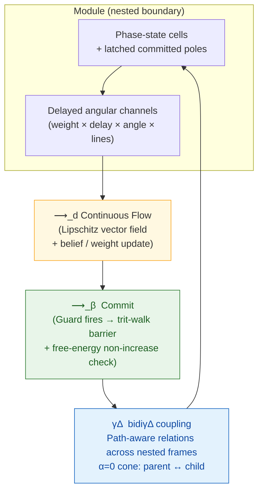

# BiDi Coherence-Delta Calculus

<p align="center">
  
</p>

<p align="center">
  <strong>A minimal formal substrate for hybrid systems</strong><br>
  Continuous flow • Guarded discrete commits • Delayed angular channels • Nested bidiγΔ coupling • Executable coherence invariants
</p>

BiDi Coherence-Delta Calculus models computation as nested boundary modules of phase-state cells, connected by delayed weighted channels that may also carry angular phase bias, dimension projection, and path-aware cross-scale endpoints. Fields evolve through continuous flow and periodically commit through event-triggered invariant gates that preserve coherence and reject free-energy-increasing transitions.

## Installation & Exploration

Requires Python ≥ 3.10. Zero runtime dependencies.

```bash
git clone https://github.com/ETEllis/bidi-coherence-delta-calculus.git
cd bidi-coherence-delta-calculus
./scripts/verify.sh          # Full verification gate (start here)
python3 calculus_laws.py     # Law & metatheorem witnesses
python3 cdc_boot.py system.cdc laws.cdc
python3 acceptance.py        # Capability witnesses
```

Editable install:

```bash
pip install -e .
```

## Core Architecture



**Canonical vocabulary**
- `cell` — continuous phase-state carrier with latched pole
- `channel` — directed influence with delay, weight, angular phase, and optional line projection
- `module` — bounded group with read/write cones, belief, prior
- `field` — graph of modules + channels under monoidal composition
- `commit` — discrete update enforcing nonnegative balance invariant
- `bidiγΔ` — bidirectional coherence-delta across nested reference frames and path endpoints

## Why This Substrate Exists

Modern hybrid systems routinely combine continuous simulation or control, evented transitions, delayed feedback, policy invariants, local learning, predictive belief updates, and nested scale coupling — usually implemented in fragmented toolkits.

This calculus supplies one shared, executable vocabulary and verified reference semantics for all of them under a single coherence-preserving spine.

## Novelty at a Glance

- **`bidiγΔ` operator** — first-class bidirectional coherence exchange across distinct reference frames; nesting is the `α=0` special case of the same relation operator.
- **Angular/path channels** — channels can rotate incoming phase by `angle=`, project onto selected `lines=`, and connect paths such as `P/c -> P`.
- **Trit-walk barrier + nonnegative balance** — clean discrete guard preventing rank violation on continuous-to-discrete quantization.
- **Executable free-energy (Lyapunov) witness** — global potential proven non-increasing under reduction; no full theorem prover required.
- **`.cdc` literate DSL** — single source format declaring fields, modules, channels, guards, flows, and proof obligations.
- **Zero-dependency reference implementation** — pure Python reducer + semantic spine ready for Lean/Coq/Kani port.

All five core metatheorems (preservation, soundness/Lyapunov, local confluence, time-determinism, strong normalization) are witnessed by executable code.

## Verification Status (v0.1.1)

The package passes 100%:

- 16/16 law and metatheorem witnesses
- 17/17 native `.cdc` expectations (`system.cdc`, `laws.cdc`)
- 5/5 relational phase-channel witnesses plus native `relations.cdc`
- 24/24 capability acceptance witnesses
- Deadband propagation smoke test
- Line projection validation
- Invariant registry integrity

Run the full gate anytime:

```bash
./scripts/verify.sh
```

## Native `.cdc` Example

```cdc
deadband 0.5
field demo dt=0.02 gain=1.4
  module A theta 0 0.3 0.6 0.9 1.2 1.5 omega 1.0
  module B trits + o - + o -
  channel A -> B delay=0.2 weight=1.0 angle=pi/4 lines=0,2,4
  guard B crossing 0
  flow 3.0
  commit B
  expect admissible B
end
```

## Paper

Knuth-inspired, dependency-light literate paper:

- Source: `paper/arxiv/main.tex`
- The checked source tree is the current paper source; `./scripts/verify.sh` compiles it when `tectonic` is available.

Compile locally (TeX toolchain):

```bash
cd paper/arxiv && pdflatex main.tex && pdflatex main.tex
```

## Boundaries & Next

Law checks are executable witnesses, not mechanized proofs. The formalization spine for the next pass (immutable runtime state tuple, small-step relations for flow/commit/nest, port to Lean/Coq/Kani) is in `FORMAL_SEMANTIC_SPINE.md`.

Current work delivers a compact, verified substrate — not production scaling or biological completeness.

## License

MIT License. See `LICENSE`.

---

If this substrate proves useful, cite via `CITATION.cff` or the paper.
