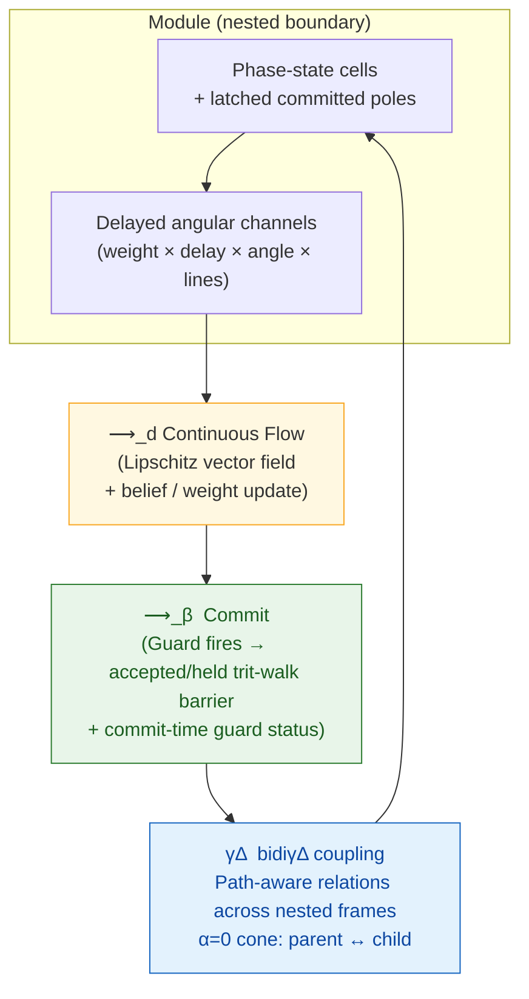
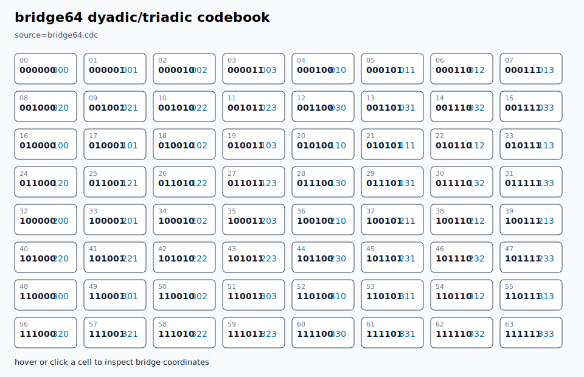

<p align="center">
  <picture>
    <source media="(prefers-color-scheme: dark)" srcset="assets/identity/renders/mobius-wordmark-static.png">
    <source media="(prefers-color-scheme: light)" srcset="assets/identity/mobius-u-wordmark-light.svg">
    
  </picture>
</p>

# BiDi Coherence-Delta Calculus

<p align="center">
  <strong>A native language with a formal coherence-calculus kernel</strong><br>
  Continuous flow • Balanced-ternary commits • Delayed angular channels • Operational bridge coordinates • Trace/window measurement
</p>

BiDi Coherence-Delta Calculus is a native `.cdc` language whose semantic kernel
is a compact coherence calculus. It models computation as nested boundary
modules of phase-state cells, connected by delayed weighted channels that may
also carry angular phase bias, dimension projection, and path-aware cross-scale
endpoints. Fields evolve through continuous flow and periodically commit through
event-triggered balanced-ternary invariant gates. A derived trace/window layer
lets any module, relation, or projected boundary act as observer, participant,
or measurement interface without adding a binary observer primitive.

## Center Of Gravity

CDC is the language. The calculus is the kernel semantics.

The repository now also carries a non-breaking **Möbi𝒰s identity candidate**:
Möbius is the embodied product, `𝒰` is the Universal Operator, and CDC remains
the formal kernel and canonical `.cdc` source contract. A validated Blender
master seats the connected eye-bearing Möbius body inside the static `ö`, opens
that same topology into `𝒰`, restores `i𝒰 → UI → 의`, and visibly evacuates the
name's central `BI` before projecting it into reflected `BIDI`; only then do
three type-derived strokes close `Δ`, after which the parent `BI` returns. The
identity assets and motion study do not rename the package or syntax. See
[`docs/identity/MOBIUS_U_IDENTITY_SYSTEM.md`](docs/identity/MOBIUS_U_IDENTITY_SYSTEM.md)
[`docs/identity/MOBIUS_U_BLENDER_PIPELINE.md`](docs/identity/MOBIUS_U_BLENDER_PIPELINE.md),
and [`docs/identity/MOBIUS_U_INTEGRATION.md`](docs/identity/MOBIUS_U_INTEGRATION.md),
then open [`demo/mobius-identity.html`](demo/mobius-identity.html) locally for
the interactive one-turn/two-turn study.

That gives the project two separate success stories:

- **Language success:** developers can install `cdc`, write `.cdc`, run `.cdc`,
  test `.cdc`, and eventually build/package `.cdc` programs without touching the
  construction host.
- **Calculus success:** the language kernel has explicit terms, reductions,
  invariants, witnesses, and theorem-prover obligations.

The only Python file left is `cdc_boot.py`, a minimal bootloader that reads
native `.cdc` declarations and verifies expectations. It is not the calculus.
The 64-state bridge has a separate non-Python runtime in
`runtime/cdc_bridge_runtime.c` that consumes `bridge64.cdc` as a lookup table,
  generates and verifies the `n=9` and `n=12` higher-arity codebooks, and emits
the interactive bridge SVG. The native reducer runtime lives in
`runtime/cdc_native_runtime.c` and executes source-declared `.cdc` `flow`,
`commit`, `nest`, `guard`, `trace`, `measure`, `policy`, `bridge`, `counter`,
`interpret`, `council`, `evolve`, and `replay` jobs from `native_reducer.cdc`,
`native_surface.cdc`, and `council_bridge.cdc`. Both C runtimes share
`runtime/cdc_source.c` / `runtime/cdc_source.h` for `.cdc` line parsing,
attribute extraction, typed attributes, and primitive expectation assertions.

## Native Status

This repository is on a native `.cdc` self-hosting track. The removal plan is
explicit in `NATIVE_SELF_HOSTING_MANDATE.md`: all current host behavior must be
replaced by native `.cdc` semantics and witnesses before host files are deleted
without breaking verification.

The practical bootloader decision for this release is now enforced by the repo:
Python is allowed only as `cdc_boot.py`. `.cdc` owns the source terms, declared
reducer rules, proof obligations, capability witnesses, and self-hosting
contract.

## Installation & Exploration

Requires Python >= 3.10 and a C compiler (`cc`) for the full verification gate.
There are no package dependencies.

```bash
git clone https://github.com/ETEllis/bidi-coherence-delta-calculus.git
cd bidi-coherence-delta-calculus
./scripts/verify.sh          # Full local verification gate (start here)
./scripts/verify.sh --require-formal  # CI-equivalent gate requiring Lean, Rocq/Coq, and Tectonic
python3 cdc_boot.py          # Native .cdc contract/witness verification
```

Editable install:

```bash
pip install -e .
```

## Core Architecture



**Canonical vocabulary**
- `cell` — continuous phase-state carrier with latched pole
- `channel` — directed influence with delay, weight, angular phase, and optional line projection
- `module` — bounded group with read/write cones, belief, prior
- `field` — graph of modules + channels under monoidal composition
- `commit` — discrete update enforcing a balanced-ternary nonnegative balance invariant
- `bidiγΔ` — bidirectional coherence-delta across nested reference frames and path endpoints
- `window` — derived observer projection over a field, producing ternary traces and measurement records

## Why This Substrate Exists

Modern hybrid systems routinely combine continuous simulation or control, evented transitions, delayed feedback, policy invariants, local learning, predictive belief updates, and nested scale coupling — usually implemented in fragmented toolkits.

This calculus supplies one shared, executable vocabulary and verified reference semantics for all of them under a single coherence-preserving spine.

## Novelty at a Glance

- **`bidiγΔ` operator** — first-class bidirectional coherence exchange across distinct reference frames; nesting is the `α=0` special case of the same relation operator.
- **Angular/path channels** — channels can rotate incoming phase by `angle=`, project onto selected `lines=`, and connect paths such as `P/c -> P`.
- **Trace/window observer layer** — any module, relation, or projected boundary can hold a causal window; committing measurements are guarded balanced-ternary commits.
- **Trace-order locality** — phase-time can flow smoothly while event-time remains local to the observing window; there is no required global tick.
- **Recursive window policy** — observer windows can carry local counters and projection/update policy without adding a binary observer or global clock.
- **Balanced-ternary carrier** — committed values are `-1 / 0 / +1` around real equilibrium, not binary false/true labels.
- **Existence viability** — frames persist by preserving bounded coherent continuity while retaining mode-appropriate transition capacity.
- **64-state dyadic/triadic bridge** — `bridge64.cdc` declares every `2^6 = 4^3 = 64` codebook row for bootstrap/runtime bridge design.
- **Generated higher-arity codebooks** — `bridge512.cdc` and `bridge4096.cdc` contain the full generated rows for `n=9` and `n=12`, with runtime regeneration checks. The verified bootstrap arity is `n=6`; arbitrary `n=3k` generation is still a future proof/generator obligation.
- **Operational bridge runtime** — `runtime/cdc_bridge_runtime.c` parses `bridge64.cdc`, verifies bijection, performs dyadic/triadic lookup, projects trace trits into bridge coordinates, verifies generated codebooks, and emits an interactive 64-cell SVG.
- **Operational native reducer** — `runtime/cdc_native_runtime.c` parses `native_reducer.cdc` and executes source-declared flow, accepted commit, held commit, and nest transitions.
- **Shared native source core** — `runtime/cdc_source.c` / `runtime/cdc_source.h` provide the common `.cdc` parser helpers and expectation checks used by the bridge, reducer, replay, and WASM export paths.
- **Native full-surface runtime** — `native_surface.cdc` exercises guard, trace, measure, policy, bridge, and counter forms through the same C runtime.
- **Native compile/interpreter/proof path** — the same runtime emits reducer IR, executes that IR through an interpreter path, and exhaustively checks the finite n=6 balanced-ternary walk spectrum.
- **Council + self-evolution scenario** — `council_bridge.cdc` deliberates across modules into a bridge coordinate and writes a bridge-coordinate witness into an evolved `.cdc` source copy.
- **Native task frameworks** — `framework_transition.cdc`, `framework_procedural.cdc`, `framework_episodic.cdc`, and `framework_deliberative.cdc` bind state-change, procedural-memory, episodic-memory, and decision patterns onto executed kernel jobs, registered as capabilities `H1`–`H4` (see `FRAMEWORKS.md`).
- **Typed framework contracts** — each framework declares `requires=` roles and `permits=` primitives; `expect framework <key> complete` enforces role completeness, uniqueness, orphan closure, and role-primitive compatibility in the bootloader.
- **Executed task-loop composition** — `framework_loop.cdc` (`H5`) runs the sense → act → integrate loop twice over one shared state object, with second-cycle expectations reachable only through carried state, then records, recalls, decides, and enacts from the same source.
- **Universal Operator `𝒰`** — the guarded, scale-relative closure of `bidiγΔ`: where `bidiγΔ` is open bidirectional transport between reference frames, `universal` is its closed lifted return — reciprocal receptive/radiant angularly biased causal cones active in one flow evaluation, internal flow/commit/nest reductions, a double-cover lifted frame (projected phase mod 2π, winding, Z2 sheet, holonomy) that closes only after 720°, and enactment of the runtime-computed record. Derived over `flow`/`commit`/`nest` — not a fourth foundational reduction. The finite sheet-parity claims (one turn inverts, two turns restore) are mechanized in Lean and Coq; the Möbius/double-cover picture is a topological realization, not a claim that carrier states are physical spinors.
- **Trit-walk barrier + nonnegative balance** — clean discrete guard preventing rank violation on continuous-to-discrete quantization.
- **Native guard witnesses** — commit-time guards report `accepted`, `held`, or `degraded` status plus a reason such as `none`, `balance-violation`, `energy-increase`, or `deadband-jitter`; continuous free-energy descent remains scoped to witnessed subset obligations.
- **`.cdc` literate DSL** — single source format declaring fields, modules, channels, guards, flows, and proof obligations.
- **Native kernel contract** — `kernel.cdc` starts the self-hosting path by declaring calculus terms, reducer rules, capabilities, and the shrinking bootloader boundary.
- **Minimal bootloader** — `cdc_boot.py` only loads `.cdc`, checks declarations, and reports expectations.

Core metatheorems and bridge invariants are witnessed by native `.cdc`. The
finite discrete layer now has an executable C proof check plus Lean and Coq
source mirrors for the same n=6 carrier spectrum.

## Verification Status (v0.2.4)

The package passes 100% through `./scripts/verify.sh`. CI runs the stricter
`./scripts/verify.sh --require-formal` gate in `.github/workflows/ci.yml`:

- 1/1 Python bootloader file: `cdc_boot.py`
- 238/238 native `.cdc` expectations
- 14/14 native invariant declarations
- 38/38 native capability declarations
- 5/5 native framework contracts with enforced role completeness
- 4811/4811 native witness declarations
- C bridge runtime compile, lookup, trace-coordinate, generated higher-arity codebook, and interactive grid/SVG checks
- C native reducer runtime run/compile/interpret/proof/surface/council/evolve/replay checks, including explicit accepted and held commit statuses
- C native task-framework checks: transition, procedural, episodic (with bidirectional codebook recall), and deliberative exemplars from the four `framework_*.cdc` files
- C native task-loop composition: `framework_loop.cdc` executes two sense/act/integrate cycles over one shared state object, then proceduralizes, records, recalls, decides, and enacts from the same source
- Bootloader-enforced framework role contracts: `framework` declarations with `requires=`/`permits=` checked for completeness, uniqueness, closure, and role-primitive compatibility
- Universal Operator closure: the `universal` runtime mode runs the whole loop over one live state object, checks reciprocal receptive/radiant cones, 720-degree lifted-frame closure with holonomy 0.125, record/decision coordinate agreement, and enacts only after acceptance — with three held negative fixtures (360-only, nonreciprocal cone, coordinate mismatch)
- Shared C `.cdc` parser/expectation core linked into both native runtimes and compile-checked for the WASM export path
- Native replay JSON freshness for `demo/replay.json` and the one-screen demo embed
- WASM replay export surface compile check, with live `emcc` link when Emscripten is available
- Lean and Rocq/Coq finite carrier and algebraic law proof checks
- Paper compile through `tectonic`
- CI installs Lean 4.31.0, Rocq/Coq 9.1.1, and Tectonic 0.16.9 and treats the native contract, C runtimes, generated artifact freshness, finite proof mirrors, and paper compile as one required gate

Run the full gate anytime:

```bash
./scripts/verify.sh
./scripts/verify.sh --require-formal
```

## Layered Value Proposition

- **Language layer:** `.cdc` is the source of record for fields, modules, channels, reducers, witnesses, and expectations.
- **Runtime layer:** C runtimes execute the bridge, reducer, surface, council, and source-evolution jobs directly from `.cdc` through a shared native parser/expectation core.
- **Formal layer:** Lean, Rocq/Coq, and native finite checkers cover the `n=6` carrier/algebra bootstrap while larger continuous proofs remain explicitly queued.
- **Product layer:** generated bridge assets and native replay JSON expose the runtime trace as an inspectable demo without claiming live WASM or `cdc_boot.py` parity yet.

## Native `.cdc` Example

```cdc
kernel bidi stage=2 target=cdc
  term cell channel module field counter trace window measurement bridge policy
  rule flow commit nest relation trace trace-order window measure adapt synchronize
  provides native-witness-suite native-capability-suite
  bootloader read-source parse-lines collect-native-declarations verify-expectations report
  expect native substrate == cdc
  expect python-files == 1
  expect witnesses >= 4811
end
```

## Operational Bridge

<p align="center">
  
</p>

The bridge is operational, not only declared:

```bash
build/cdc_bridge_runtime verify bridge64.cdc
build/cdc_bridge_runtime lookup-dyadic bridge64.cdc 101011
build/cdc_bridge_runtime lookup-triadic bridge64.cdc 223
build/cdc_bridge_runtime project-trits bridge64.cdc '+0-+0-' council
build/cdc_bridge_runtime run-jobs bridge64.cdc bridge_jobs.cdc
build/cdc_bridge_runtime verify-codebook bridge512.cdc 9
build/cdc_bridge_runtime verify-codebook bridge4096.cdc 12
build/cdc_bridge_runtime emit-codebook 9
build/cdc_bridge_runtime emit-codebook 12
build/cdc_bridge_runtime grid-svg bridge64.cdc
```

`./scripts/verify.sh` compiles the runtime, runs those checks, and confirms that
the tracked 64-cell interactive SVG and the generated `bridge512.cdc` and
`bridge4096.cdc` files match runtime output. Details are in `BRIDGE_RUNTIME.md`.

## Native Reducer Runtime

The reducer is no longer only a target described in prose. `native_reducer.cdc`
declares a small field with modules, cells, an angular channel, and four
source-level reducer jobs:

```bash
build/cdc_native_runtime run native_reducer.cdc
build/cdc_native_runtime compile native_reducer.cdc
build/cdc_native_runtime interpret native_reducer.cdc
build/cdc_native_runtime prove native_reducer.cdc
build/cdc_native_runtime surface native_surface.cdc
build/cdc_native_runtime council council_bridge.cdc
build/cdc_native_runtime evolve council_bridge.cdc
build/cdc_native_runtime replay native_reducer.cdc native_surface.cdc
```

The C runtime consumes that source and executes:

- `flow`: continuous phase evolution plus angular channel coupling;
- `commit`: balanced-ternary quantization with explicit `accepted` or `held` status;
- `nest`: child coherence upward and parent context downward.
- `compile`: reducer source to a small IR listing;
- `interpret`: execute the compiled reducer IR as an IR path rather than only printing it;
- `prove`: exhaustive n=6 trit-walk counts: `729 / 267 / 51 / 20 / 5`.
- `surface`: guard, trace, measurement, policy, bridge-coordinate, and counter clauses;
- `council`: deliberate across source-declared council members into a bridge coordinate;
- `evolve`: write a bridge-coordinate witness into a copied `.cdc` source.
- `replay`: emit the Flow -> Commit -> Nest -> Trace -> Bridge JSON used by `demo/replay.json` and `demo/index.html`.

`runtime/cdc_source.c` / `runtime/cdc_source.h` factor the shared native
`.cdc` line parser, attribute reader, typed attribute accessors, and primitive
expectation checks used by both C runtimes. This is a native parser/expectation
core, not full `cdc_boot.py` parity; repo-wide declaration checking remains
queued until the C/WASM path covers the bootloader's whole contract surface.

`runtime/cdc_wasm_exports.c` wraps the replay path with a C ABI suitable for an
Emscripten build. The verification gate always compiles that export surface as
C, and links a live WASM replay module when `emcc` is installed. Full browser
WASM execution and repo-wide `cdc_boot.py` parity remain queued rather than
claimed.

`cdc_boot.py` only indexes those declarations and verifies their witness links;
it does not execute the reducer.

## Task Frameworks

Four generalizable task frameworks bind practical task vocabulary onto the
kernel primitives without any new grammar or host code — each is a `.cdc`
file with a capability registry entry, binding witnesses linked to executed
jobs, and a deterministic exemplar checked by the verification gate:

```bash
build/cdc_native_runtime run framework_transition.cdc        # state change: guard, act, fire, block, lift
build/cdc_native_runtime surface framework_transition.cdc
build/cdc_native_runtime compile framework_procedural.cdc    # skills: declarative source -> reducer IR
build/cdc_native_runtime interpret framework_procedural.cdc  # skilled execution through the IR path
build/cdc_native_runtime run framework_episodic.cdc          # episodes: live, record, consolidate
build/cdc_native_runtime surface framework_episodic.cdc      # recall, key, ordinal
build/cdc_native_runtime council framework_deliberative.cdc  # options -> quorum -> decision coordinate
build/cdc_native_runtime evolve framework_deliberative.cdc   # decision enacted as source memory
build/cdc_native_runtime run framework_loop.cdc              # the whole loop: two cycles, one state object
build/cdc_native_runtime interpret framework_loop.cdc        # the whole loop re-executed as compiled IR
build/cdc_native_runtime universal framework_loop.cdc        # U720 closure: one live state through reduce,
                                                             # record, decide, closure checks, and enactment
```

Each framework also declares a typed contract (`framework <key> requires=...
permits=...`) that the bootloader enforces through `expect framework <key>
complete`: every required role bound exactly once, every binding linked to a
declared executable job, every linked primitive permitted, and no orphan
framework bindings anywhere in the tree (`expect frameworks closed`).

The binding tables, the generic task loop, the contract semantics, and the
explicitly queued obligations are documented in `FRAMEWORKS.md`.

Lean and Coq mirrors of the finite carrier and algebraic law proof live in
`formal/lean/CDCFinite.lean` and `formal/coq/CDCFinite.v`. `./scripts/verify.sh`
runs them automatically when the corresponding toolchain is installed.

## Paper

Knuth-inspired, dependency-light literate paper:

- Source: `paper/arxiv/main.tex`
- The checked source tree is the current paper source; `./scripts/verify.sh` compiles it when `tectonic` is available.

Compile locally (TeX toolchain):

```bash
cd paper/arxiv && pdflatex main.tex && pdflatex main.tex
```

## Boundaries & Next

The finite carrier layer and finite algebraic laws now have executable proof
checks. The broader formalization spine (immutable runtime state tuple,
small-step relations for flow/commit/nest, and expanded Lean/Coq/Kani proofs) is in
`FORMAL_SEMANTIC_SPINE.md`.

Claim-to-witness-to-proof tracking is in `VERIFICATION_OBLIGATION_MATRIX.md`.
The observer/measurement extension is documented in `TERNARY_TRACE_WINDOW_SEMANTICS.md`.
The native self-hosting mandate is documented in `NATIVE_SELF_HOSTING_MANDATE.md`.
The task-framework layer is documented in `FRAMEWORKS.md`.

Current work delivers a compact, verified substrate — not production scaling, biological completeness, or a finished physics theory.

## License

MIT License. See `LICENSE`.

---

If this substrate proves useful, cite via `CITATION.cff` or the paper.
